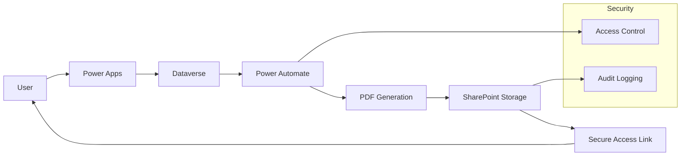

# Automated Check Printing System

## Context

A business application required the ability to generate and print multiple financial checks in a secure and controlled manner.

The process needed to support batch operations while ensuring strict control over document access and traceability.

## Challenges

- Secure generation of financial documents
- Batch processing for multiple records
- Controlled access to sensitive outputs
- Integration with document storage
- Avoiding duplication and errors

## Architecture approach

The solution was designed using a low-code, integration-first architecture:

- Power Apps for user interaction
- Dataverse as the transactional data layer
- Power Automate for orchestration
- SharePoint for secure document storage

The architecture ensured separation between data, process and document management.

## Key decisions

- Centralized document generation through controlled workflows
- Use of temporary secure links instead of direct file exposure
- Batch orchestration using Power Automate to ensure consistency
- Decoupling UI from document generation logic

## Architecture Overview

## Results & Impacts

- Reduced manual intervention and errors
- Improved security and access control
- Scalable batch processing capability
- Increased reliability of financial operations

## Architecture Principles Applied

- Separation of concerns
- Security by design
- Integration-first approach
- Scalability and maintainability
