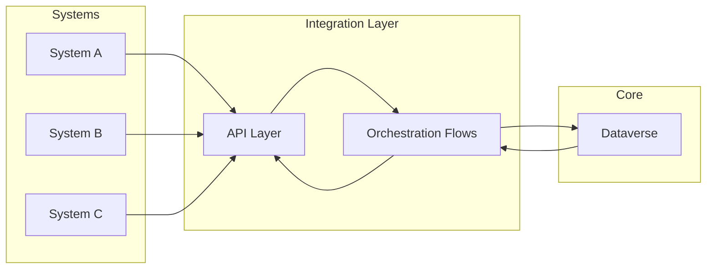

# Enterprise Integration Hub

## Context

Multiple systems required synchronization of business data across different platforms, leading to inconsistencies and operational inefficiencies.

## Challenges

- Data inconsistency
- Integration complexity
- Performance concerns
- Duplication of business data

## Architecture approach

A centralized integration model was implemented:

- Dataverse as the system of reference
- APIs for system communication
- Power Automate for orchestration

The architecture followed an API-first and integration-driven approach.

## Key decisions

- Establishing Dataverse as the central data authority
- Using APIs to decouple systems
- Implementing controlled synchronization flows
- Avoiding direct system-to-system dependencies

## Architecture overview

## Results & Impact

- Improved data consistency across systems
- Reduced duplication and errors
- Simplified integration logic
- Better system reliability

## Architecture Principles Applied

- Separation of concerns
- Security by design
- Integration-first approach
- Scalability and maintainability
