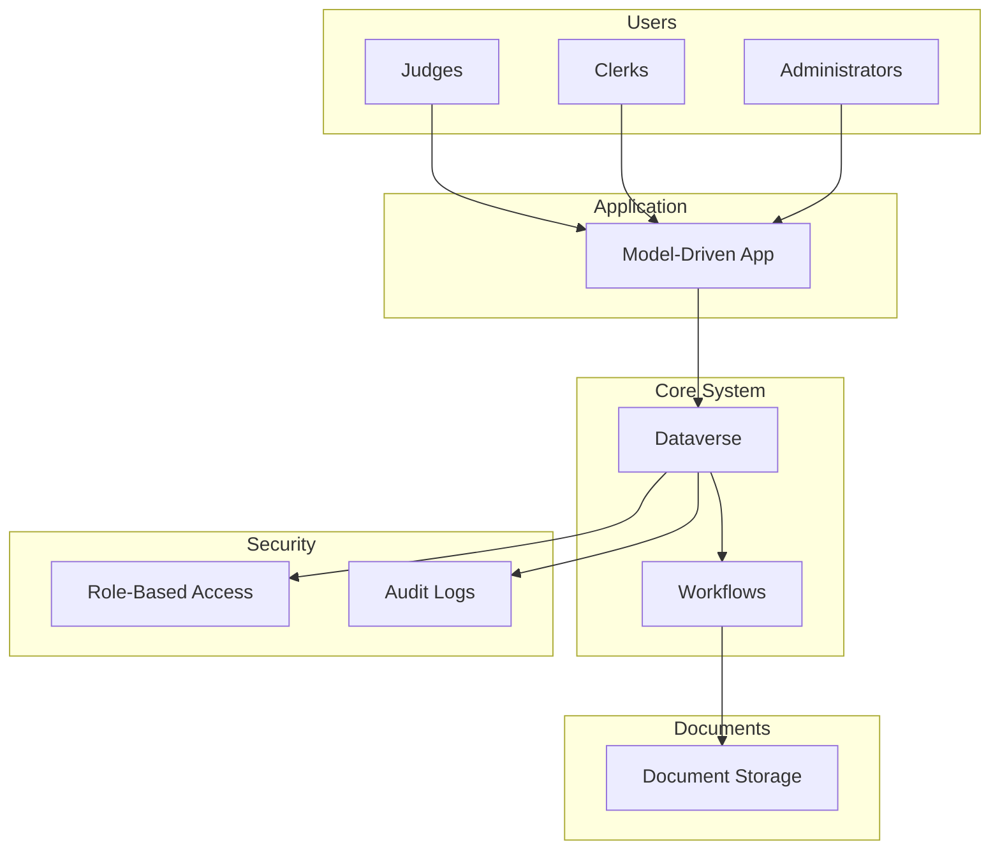

# Judicial Case Management System (Conceptual)

## Context

Design of a system to manage judicial cases, including records, decisions, and document workflows, within a highly regulated environment.

The system needed to support multiple stakeholders while ensuring compliance with strict data governance and audit requirements.

## Challenges

- Highly sensitive data
- Complex workflows across multiple actors
- Strong audit and traceability requirements
- Role-based access control
- Long-term data integrity

## Architecture approach

The solution was designed around a secure, data-centric architecture:

- Dataverse as the authoritative data source
- Model-driven applications for structured user interaction
- Power Automate for workflow orchestration
- Role-based security model for access control

The architecture prioritized traceability, governance and compliance.

## Key decisions

- Strict data segmentation based on roles and responsibilities
- Full audit logging for all critical operations
- Standardized workflows to ensure consistency
- Separation between operational data and documents

## Architecture overview

## Results & Impact

- Improved traceability and accountability
- Enhanced compliance with regulatory requirements
- Scalable architecture for long-term evolution
- Clear governance model for data and access

## Architecture Principles Applied

- Separation of concerns
- Security by design
- Integration-first approach
- Scalability and maintainability
