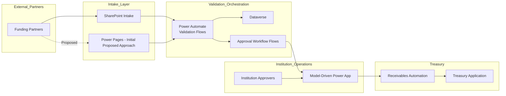

# Public-Sector Funding Integration & Receivables Automation

## Overview

Designed a secure enterprise integration architecture connecting public-sector institutions with external funding partners responsible for financing social programs.

The solution streamlined the intake, validation, approval, and financial registration of funding transactions while enforcing strong governance, segregation of duties, and least-privilege access control across multiple organizations.

The architecture was designed to support:
- Multi-institution collaboration
- Multiple external funding partners
- Secure submission of funding information
- Validation and approval workflows
- Automated treasury integration
- Financial receivables tracking
- Enterprise-grade governance and security

---
## Architecture Overview

---
## Business Context

External funding partners periodically provide funding allocations and payment schedules to participating institutions responsible for executing social programs.

Before this initiative:
- Funding information processing was fragmented
- Validation steps were manual and error-prone
- Approval workflows lacked traceability
- Financial integrations were inconsistent
- Security boundaries between organizations were difficult to maintain

The objective was to create a centralized and governed intake and approval process capable of supporting multiple organizations while preserving autonomy, security, and auditability.

---

## Proposed Architecture

The original architecture proposal introduced:
- Secure partner intake portal
- Automated validation workflows
- Role-based approval orchestration
- Treasury integration automation
- Centralized Dataverse data model
- Multi-application Power Platform ecosystem

### Intake Layer

External funding partners submit:
- Structured funding information
- Supporting documentation
- Batch transaction files

The initial recommended architecture used:
- Power Pages for secure external access
- Guided data entry experiences
- File upload capabilities
- Real-time validation during submission

To align with client constraints, the final implementation adopted a SharePoint-based document intake approach while preserving the remainder of the orchestration and governance architecture.

---

## Validation & Workflow Automation

Power Automate workflows were designed to:
- Validate submitted information
- Enforce business rules
- Detect incomplete or invalid submissions
- Trigger approval processes
- Generate traceable operational records

The validation architecture included:
- Synchronous validation during intake
- Asynchronous backend validation workflows
- Controlled exception handling
- Audit-friendly processing states

---

## Approval Management

Validated submissions generated approval requests stored in Dataverse.

Institution representatives could:
- Review requests
- Validate financial information
- Approve or reject submissions
- Track processing history
- Maintain audit traceability

A model-driven Power App provided:
- Operational dashboards
- Approval queues
- Status monitoring
- Governance controls
- Secure access segmentation

---

## Treasury & Financial Integration

Approved requests automatically generated financial receivable records consumed by the institution treasury solution.

The treasury integration architecture enabled:
- Controlled receivable creation
- Financial visibility
- Traceable transaction lifecycle
- Reduced manual financial operations
- Consistent downstream processing

---

## Security & Governance

Security was designed using:
- Least privilege principles
- Role-based access control
- Segregation of responsibilities
- Organizational access boundaries
- Controlled visibility rules

The solution architecture enforced:
- Separation between funding partners and institutions
- Controlled access to operational records
- Secure approval responsibilities
- Governance-ready auditability

---

## Architecture Highlights

- Multi-organization integration architecture
- Public-sector workflow orchestration
- Power Platform enterprise architecture
- Dataverse-centered governance model
- Automated financial processing
- Secure approval workflows
- Enterprise security segmentation
- Scalable intake and validation design

---

## Technologies

- Microsoft Power Platform
- Power Apps (Model-Driven Apps)
- Power Automate
- Dataverse
- Power Pages (initial proposed architecture)
- SharePoint
- Microsoft Entra ID

---

## Outcome

The architecture established:
- Standardized funding intake processes
- Improved operational traceability
- Reduced manual validation effort
- Stronger governance controls
- Secure inter-organization collaboration
- Automated receivable generation workflows

The solution demonstrated how Power Platform can support enterprise-grade public-sector integration scenarios involving multiple organizations, governance constraints, and financial operational processes.
