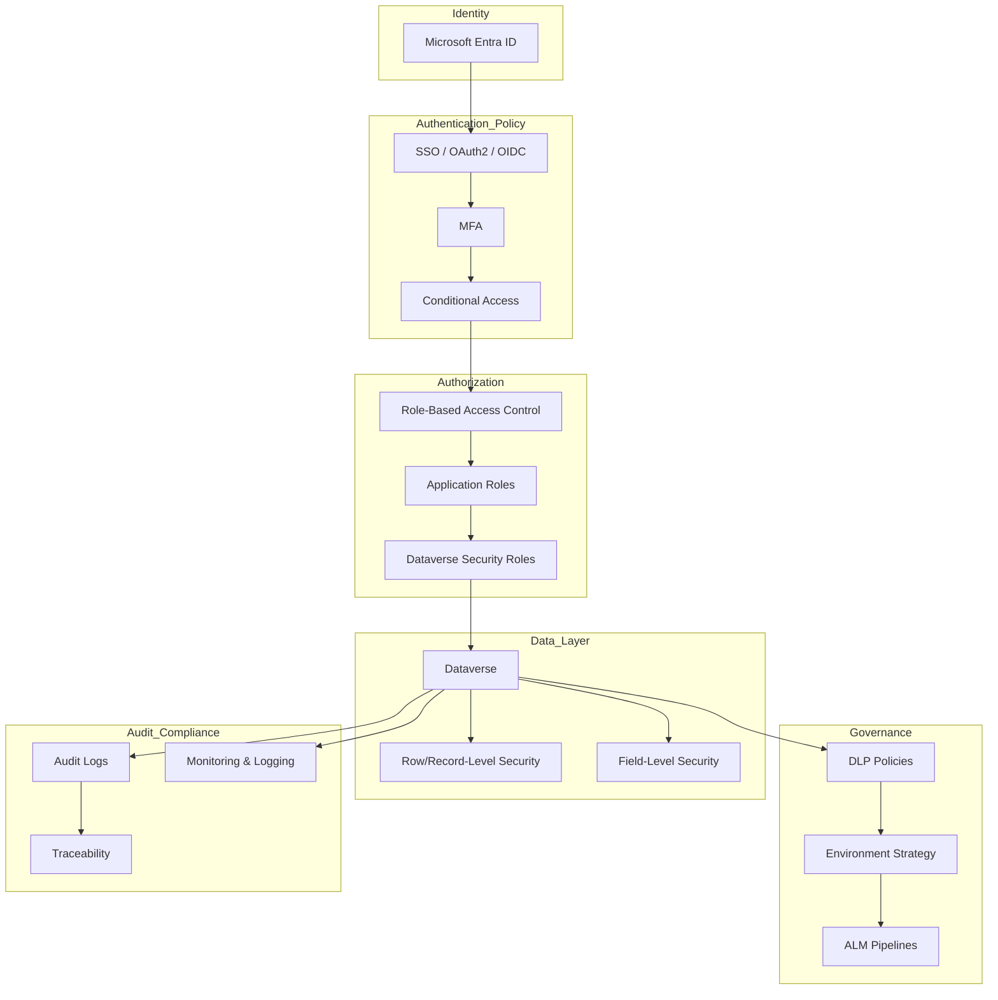

# Data & Security Architecture

## Secure by design

## Data architecture

- Transactional vs reference data
- Data lifecycle management
- Data ownership boundaries

## Security

- Role-based access control
- Data segmentation
- Least privilege principle

## Compliance and audit

- Audit trails
- Data traceability
- Regulatory alignment

