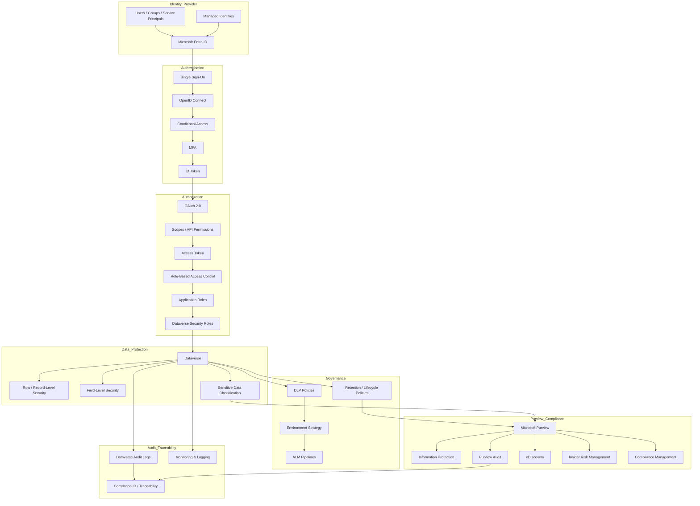
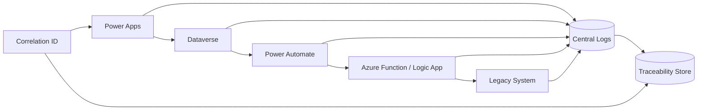

# Data & Security Architecture

## Secure by design

The architecture applies security and compliance principles from the beginning of the solution lifecycle.

Security is implemented across multiple layers:

- Identity and authentication
- Authorization and access control
- Data protection
- Governance and compliance
- Audit and traceability

This layered model helps ensure that users are properly authenticated, access is granted according to business responsibilities, sensitive data is protected, and key activities remain traceable.

---

## Data architecture

The data architecture distinguishes between different types of data and their governance needs:

- **Transactional data** — operational business records created and updated by users or automated processes.
- **Reference data** — stable lookup or classification data used to support business rules.
- **Sensitive data** — personal, confidential, legal, or regulated information requiring additional protection.
- **Audit data** — records of system activity, data changes, and integration events.

Key principles:

- Data ownership is clearly defined.
- Data lifecycle rules are applied from creation to retention or disposal.
- Sensitive data is protected using access control, segmentation, and compliance policies.
- Data changes and integration events are traceable end-to-end.

---

## Identity and authentication

Microsoft Entra ID is used as the central identity provider for users, groups, service principals, and application identities.

The authentication layer supports:

- Single Sign-On
- OpenID Connect
- Multi-factor Authentication
- Conditional Access
- Token-based authentication

Microsoft Entra ID provides the foundation for verifying user and application identities before access is granted to business applications or data services.

---

## Authorization and access control

Authorization is enforced at multiple levels:

- OAuth 2.0 scopes and API permissions
- Role-based access control
- Application roles
- Dataverse security roles
- Row-level / record-level security
- Field-level security

This ensures that authenticated users can only perform actions aligned with their assigned business responsibilities.

The architecture follows the principle of least privilege, limiting access to the minimum required permissions.

---

## Data security and compliance

Microsoft Purview supports data security and compliance capabilities across the Microsoft ecosystem, including data governance, data protection, and compliance solutions.

Relevant Purview capabilities include:

- Information Protection
- Data Loss Prevention
- Audit
- Data lifecycle and retention
- eDiscovery
- Insider risk management
- Compliance management

Power Platform DLP policies are also used to control how connectors can be combined and to reduce the risk of sensitive data being shared with unauthorized services.

---

## Compliance and audit

Audit and compliance capabilities help answer:

- Who accessed or changed data?
- What action was performed?
- When did it happen?
- Which process or integration triggered the change?
- Was the action compliant with policy?

Audit capabilities include:

- Dataverse auditing
- Power Platform activity logs
- Microsoft Purview Audit
- Azure monitoring and logs
- Integration traceability logs

Microsoft Purview Audit captures user and admin operations across Microsoft 365 services in a unified audit log, supporting investigations, compliance obligations, and forensic analysis. 

---

## Traceability

Traceability is implemented using a unique Correlation ID generated once per transaction and propagated across the system.

The Correlation ID is:

- generated once at the entry point;
- stored with the business transaction;
- propagated through flows, APIs, and integrations;
- logged at every stage.

This enables end-to-end tracking across:

- Power Apps
- Dataverse
- Power Automate
- Azure Functions / Logic Apps
- Legacy systems
- Central monitoring tools
