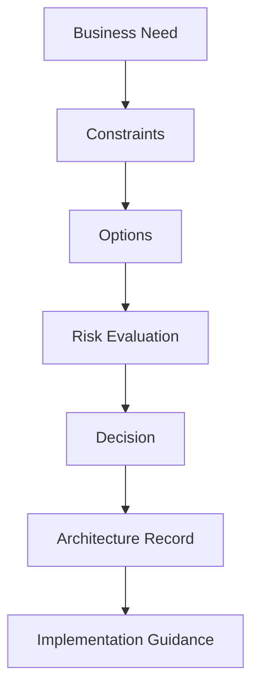

# Architecture Decision Making

Every architecture decision involves trade-offs.

I evaluate:

- Business constraints
- Technical limitations
- Long-term impact
- Risks and scalability
- Operational sustainability

I document key decisions and ensure alignment across stakeholders before implementation.

## Decision framing example

