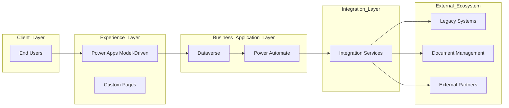
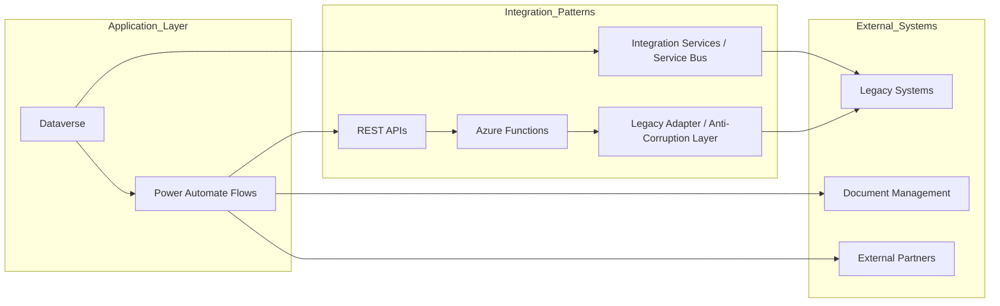

# Integration Architecture

## Designing reliable integration ecosystems

I design integration strategies based on context, constraints and long-term sustainability.

## Integration patterns

- API-first architecture
- Event-driven integration
- Batch processing workflows
- Document-based integrations

## Technologies

- Power Automate orchestration
- Azure Integration Services
- REST APIs
- Dataverse
- SharePoint and document management

## Key considerations

- Performance and scalability
- Data consistency
- Security and access control
- Reliability and fault tolerance

## Example integration flow

Master Architecture — Overview

This diagram presents a high-level view of the solution architecture, focusing on the flow of user interactions, business logic, and external integrations.

The architecture is structured in layered form:

- Client Layer represents end users interacting with the system.
- Experience Layer includes applications such as Power Apps and custom UI components that deliver the user experience.
- Business Application Layer centralizes core business logic and data using Microsoft Dataverse and process automation via Power Automate.
- Integration Layer abstracts all communication with external systems, ensuring loose coupling and scalability.
- External Ecosystem includes legacy systems, document services, and partner integrations.

This layered approach promotes:

- Clear separation of concerns
- Scalability and maintainability
- Flexibility to evolve integration strategies independently from core business applications

Integration Architecture — Detailed View

This diagram provides a detailed view of the integration layer and illustrates how different integration patterns are used to connect the platform with external systems.

Integration Patterns

The architecture combines multiple integration styles:

- Synchronous integration (REST APIs)
  Used for real-time operations where immediate responses are required. Power Automate flows invoke APIs exposed through Azure Functions.
- Serverless integration (Azure Functions)
  Azure Functions acts as a lightweight middleware layer responsible for:
  - Protocol transformation (REST ↔ SOAP, SQL, etc.)
  - Data mapping and validation
  - Error handling and retries
- Legacy Adapter / Anti-Corruption Layer
  This layer isolates modern applications from legacy system constraints by translating data models and communication protocols. It prevents legacy complexity from leaking into the core platform.
- Asynchronous integration (Integration Services / Service Bus)
  Used for decoupled, event-driven communication. This pattern improves resilience, scalability, and fault tolerance.
  
External Integrations
- Legacy Systems are accessed through controlled adapters to ensure stability and backward compatibility.
- Document Management systems are integrated for file storage and retrieval.
- External Partners are connected via APIs or secure data exchange mechanisms.

## Architectural Rationale
This architecture intentionally separates:

- User experience from business logic
- Business logic from integration concerns
- Modern systems from legacy constraints

By combining synchronous and asynchronous patterns, the solution achieves:

- Real-time responsiveness where needed
- Loose coupling between systems
- Improved fault tolerance and scalability
